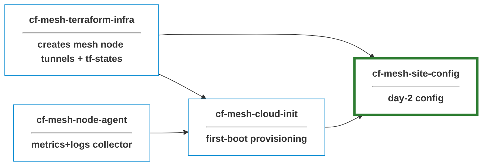

# cf-site-config

Ansible configuration for Cloudflare Mesh node.

## Prerequisites

- `terraform` CLI on `PATH` (the inventory plugin shells out to it for `show`; `bin/init-tfstate` uses `init` / `workspace`)
- AWS credentials with read access to the S3 state bucket (env vars or `~/.aws/credentials` — note the `[default]` section header is required)
- `ansible-core >= 2.16`, Python `>= 3.11`

#### Required secrets and variables

| Name | Kind | Scope | Purpose |
| :--- | :--- | :---- | :------ |
| `AWS_ACCESS_KEY_ID` | secret | Environment (dev/prod) | Read TF state from S3 |
| `AWS_SECRET_ACCESS_KEY` | secret | Environment (dev/prod) | Read TF state from S3 |
| `AWS_REGION` | variable | Repo | Defaults to `eu-west-2` |

## Inventory

Inventory for mesh nodes is **sourced from Terraform S3-backed state** produced by
[`cf-mesh-terraform-infra`](https://github.com/prometejs/cf-mesh-terraform-infra) via
[`cloud.terraform.terraform_state`](https://github.com/ansible-collections/cloud.terraform)
inventory plugin.

**_For configs that target devices within a mesh node's private network, additional inventory files can be created and referenced during apply_**

**Groups**

- `environment`(workspace in terraform): maps to `dev` and `prod` GitHub Environments
- `connectors`: maps to all mesh nodes

**Host vars**

| Var                | Type            | Notes                                                  |
| ------------------ | --------------- | ------------------------------------------------------ |
| `ansible_host`     | string          | Connector IP — SSH target                              |
| `tunnel_token`     | string (secret) | Cloudflare WARP connector registration token          |
| `site_cidr`        | string          | This site's subnet, e.g. `10.20.0.0/24`                |
| `private_hostname` | string          | e.g. `dev-site-a.dev.prometejs.network`                |
| `ha_enabled`       | string bool     | `"true"` or `"false"`                                  |
| `ha_peer_ip`       | string          | Empty when not in an HA pair                           |
| `environment`      | string          | `dev` or `prod`                                        |
| `remote_cidrs`     | JSON string     | List of other sites' CIDRs — parse with `\| from_json` |

**Subject to change from tf state file**

**repository coupling**: If `cf-mesh-terraform-infra` ever changes its S3 backend (bucket / key prefix /
region), update the inventory files here to match.

## CI / Deployment
Workflows run on self-hosted GitHub Actions runner (workspace scoped), which already has access to internal private networks.

- [`lint.yml`](.github/workflows/lint.yml): static checks
- [`apply.yml`](.github/workflows/apply.yml): runs Ansible against real hosts